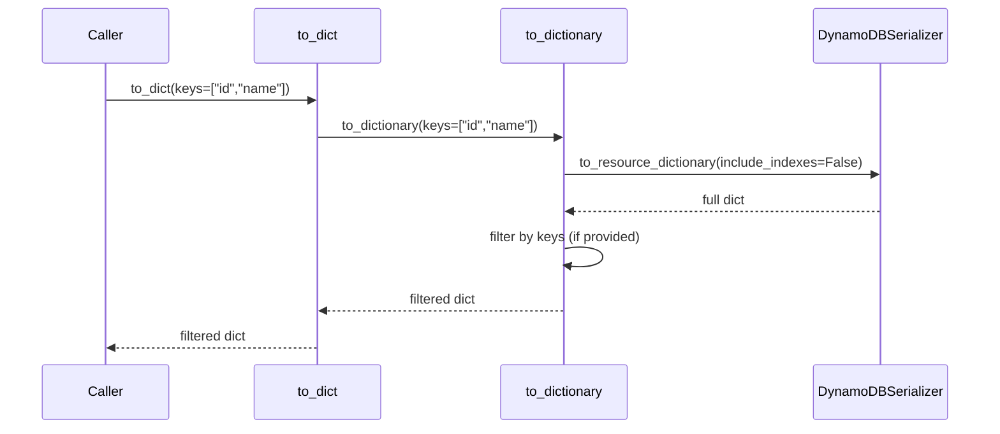

# Design Document: Dictionary Key Filter

## Overview

This feature adds an optional `keys` parameter to `DynamoDBModelBase.to_dict()` and `DynamoDBModelBase.to_dictionary()`. When provided, the returned dictionary is filtered to include only the specified top-level keys. The filtering is applied *after* the full serialization pass so that it does not interfere with the existing serialization logic.

The change is minimal: a single filtering step appended to the end of `to_dictionary()`, and a pass-through of the parameter from `to_dict()`.

## Architecture

The feature lives entirely within `DynamoDBModelBase` (the public API surface) and does not touch `DynamoDBSerializer` or `Serialization`. The flow is:



Key design decisions:

1. Filtering happens in `to_dictionary` only, after `DynamoDBSerializer.to_resource_dictionary` returns the full dictionary. This keeps serialization logic untouched.
2. `to_dict` delegates to `to_dictionary` (it already does today), so it simply forwards the new `keys` parameter.
3. Missing keys are silently omitted — no errors, no warnings. This matches the behavior of `dict.get()` and is the least surprising for callers.
4. An empty list `[]` returns `{}`. This is consistent: "give me these zero keys" → empty dict.
5. `None` (the default) means no filtering — full dict returned, preserving backward compatibility.

## Components and Interfaces

### Modified Methods

#### `DynamoDBModelBase.to_dictionary`

```python
def to_dictionary(
    self,
    include_none: bool = True,
    keys: List[str] | None = None,
) -> dict:
```

- `keys`: Optional list of top-level dictionary keys to retain. When `None`, returns the full dictionary (current behavior). When provided, returns only the key-value pairs whose keys appear in the list.

#### `DynamoDBModelBase.to_dict`

```python
def to_dict(
    self,
    include_none: bool = True,
    keys: List[str] | None = None,
) -> dict:
```

- Passes `keys` through to `to_dictionary`.

### Implementation Detail

The filtering logic is a simple dictionary comprehension applied after serialization:

```python
if keys is not None:
    d = {k: v for k, v in d.items() if k in keys}
```

This is O(n) where n is the number of keys in the full dictionary, and the `in` check on a list is O(m) where m is the length of `keys`. For typical model sizes (< 50 fields), this is negligible. If `keys` were large, converting to a `set` first would help, but that's unnecessary for the expected use case.

## Data Models

No new data models are introduced. The feature operates on the existing `Dict[str, Any]` output of `to_resource_dictionary`. The `keys` parameter is typed as `List[str] | None`.


## Correctness Properties

*A property is a characteristic or behavior that should hold true across all valid executions of a system — essentially, a formal statement about what the system should do. Properties serve as the bridge between human-readable specifications and machine-verifiable correctness guarantees.*

### Property 1: Key filtering produces the correct subset

*For any* valid `DynamoDBModelBase` instance and *for any* list of strings `keys`, calling `to_dictionary(keys=keys)` should return a dictionary whose keys are exactly the intersection of `keys` and the keys of the full (unfiltered) dictionary, and each value should equal the corresponding value in the full dictionary.

This covers: non-empty key lists return only matching keys (1.1), missing keys are silently omitted (1.2), and an empty key list returns an empty dictionary (1.4).

**Validates: Requirements 1.1, 1.2, 1.4, 3.2**

### Property 2: None-keys preserves backward compatibility

*For any* valid `DynamoDBModelBase` instance, calling `to_dictionary(keys=None)` should return a dictionary identical to calling `to_dictionary()` (no `keys` argument), which in turn equals the full serialized dictionary from `DynamoDBSerializer.to_resource_dictionary(instance, include_indexes=False)`.

**Validates: Requirements 1.3**

### Property 3: to_dict and to_dictionary equivalence

*For any* valid `DynamoDBModelBase` instance and *for any* `keys` value (including `None`), `to_dict(keys=keys)` should return a dictionary equal to `to_dictionary(keys=keys)`.

**Validates: Requirements 2.2, 2.3**

### Property 4: Filter-then-map round trip

*For any* valid `DynamoDBModelBase` instance and *for any* non-empty subset of the instance's serialized top-level keys, calling `to_dictionary(keys=subset)` and then mapping the resulting dictionary back onto a fresh instance of the same type should produce an instance where each attribute corresponding to a filtered key matches the original instance's attribute value.

**Validates: Requirements 4.1**

## Error Handling

This feature introduces no new error paths. The `keys` parameter is optional and typed as `List[str] | None`.

| Scenario | Behavior |
|---|---|
| `keys=None` (default) | Full dictionary returned — no change from current behavior |
| `keys=[]` | Empty dictionary returned |
| `keys` contains non-existent keys | Those keys are silently omitted |
| `keys` contains duplicate strings | Duplicates are harmless — dict comprehension naturally deduplicates |
| `keys` is a non-list iterable | Not explicitly supported; type hint is `List[str] \| None`. No runtime type check is added to keep the implementation minimal. |

No exceptions are raised by the filtering logic itself. The existing serialization path (`DynamoDBSerializer.to_resource_dictionary`) may raise errors as it does today, but those are unrelated to this feature.

## Testing Strategy

### Property-Based Tests (Hypothesis)

The project already uses `hypothesis` (listed in `requirements.dev.txt`). Each correctness property above maps to a single Hypothesis test.

- Library: `hypothesis` (already installed)
- Minimum iterations: 100 per property (use `@settings(max_examples=100)`)
- Each test must be tagged with a comment referencing the design property:
  `# Feature: dictionary-key-filter, Property {N}: {title}`

Strategy for generating test data:
- Use a concrete `DynamoDBModelBase` subclass (e.g., the existing `User` test model in `tests/unit/dynamodb_tests/db_models/user_model.py`) populated with Hypothesis-generated field values.
- Generate `keys` lists by drawing subsets of the full dictionary's key set, plus optionally injecting non-existent key strings.

### Unit Tests

Unit tests complement property tests by covering specific examples and integration points:

- Verify `to_dictionary(keys=["id", "first_name"])` on a `User` instance returns exactly those two fields.
- Verify `to_dictionary(keys=["nonexistent"])` returns `{}`.
- Verify `to_dictionary(keys=[])` returns `{}`.
- Verify `to_dictionary()` (no keys arg) returns the same result as before the change.
- Verify `to_dict(keys=...)` matches `to_dictionary(keys=...)`.
- Verify `include_none` interaction: `to_dictionary(include_none=False, keys=["field_that_is_none"])` returns `{}`.

### Test File Locations

- Property tests: `boto3-assist/tests/unit/dynamodb_tests/test_dictionary_key_filter_properties.py`
- Unit tests: `boto3-assist/tests/unit/dynamodb_tests/test_dictionary_key_filter.py`
